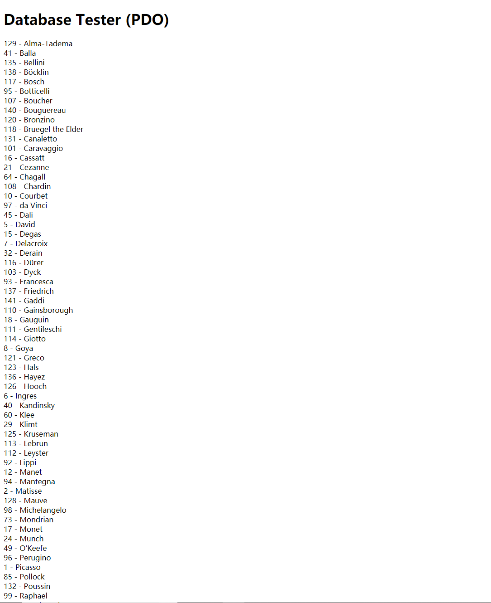
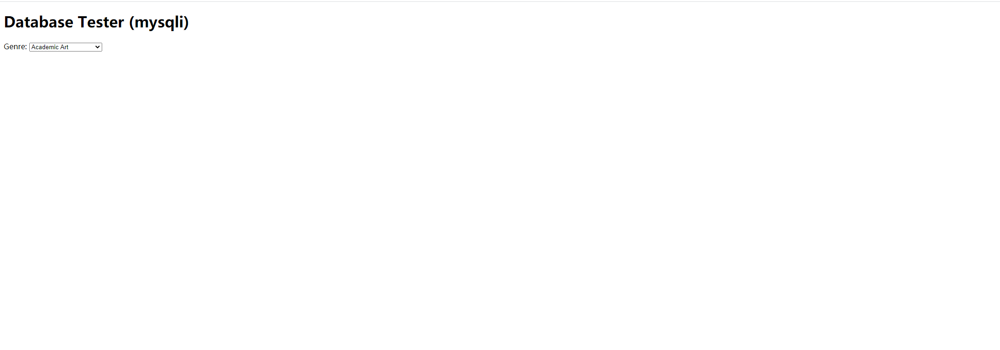
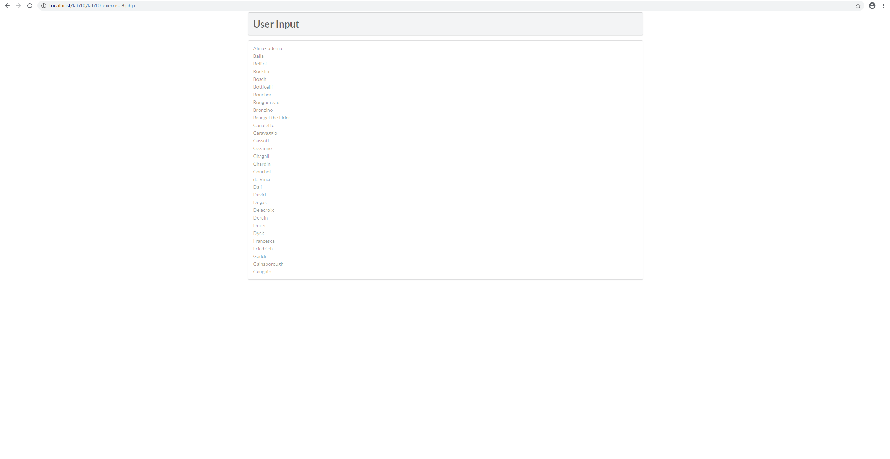
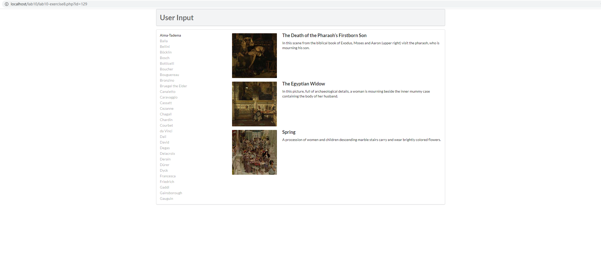
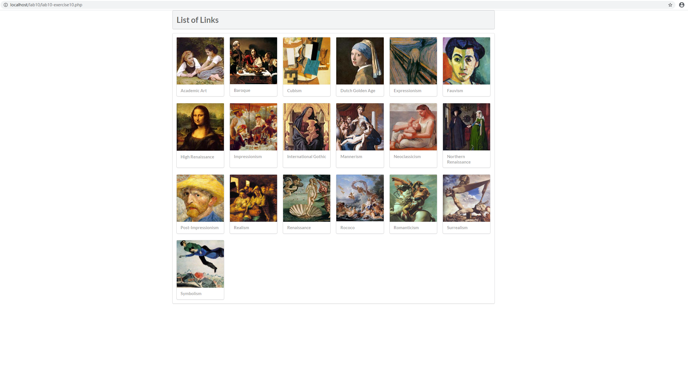

#exercise7
exercise7-pdo.php 创建一个pdo对象，从Artists表里取得所有行，以LastName的值排序

exercise7-mysqli.php 创建mysqli对象，从Genres表里取得所有行，以GenreName的值排序

#exercise8 
outputArtists()函数创建pdo对象，从Artists表里取得从第一行开始的30行，以LastName排序。
在html中，将LastName作为超链接显示，该超链接指向exercise8.php自身，但是为超级全局变量_Get添加了id属性，该id
等于LastName对应的ArtistId。

outputPaintings()函数创建pdo对象，根据id属性，从Paintings表里取得ArtistId与id相同的行，并为每一个结果
调用outputSinglePainting()函数

outputSinglePainting($row)函数根据$row的ImageFileName属性创建img元素，根据Title属性创建h4元素，
根据Excerpt属性创建p元素

#exercise9
php执行sql语句主要有三种方法:exec(),query()和预处理语句

exec()方法返回受影响的行数，当执行select语句时返回0

query()方法返回由结果行组成的集合

预处理语句中prepare()方法构造一个Statement对象，支持解析字符串内参数，execute()方法返回受影响行数，而执行完
execute()方法statement对象将拥有结果集，可以循环使用fetch()方法查询

预处理语句的好处：避免将用户输入直接传入sql语句，而是用参数传递，防止sql注入攻击；在循环操作中批量插入时，
只需要改变绑定的参数值

#exercise10
outputGenres()函数从Genres表里取得GenreID,GenreName,Description三列，以GenreName排序（表里没有eraID）
循环fetch()并调用outputSingleGenre()

outputSingleGenre($row)函数先准备好一个用于创建img元素的字符串，其src为GenreId对应的图片src，然后调用
constructGenreLink()创建图片超链接，该超链接指向genre.php并为_Get添加id属性，以供genre.php内的函数使用；
最后调用一次constructGenreLink()创建与上述图片超链接行为相同的文字超链接，以GenreName作为文字

constructGenreLink($id,$label)函数，将$id传给genre.php的_Get的id属性，以$label作为超链接的子节点，创建一个
指向genre.php的超链接
