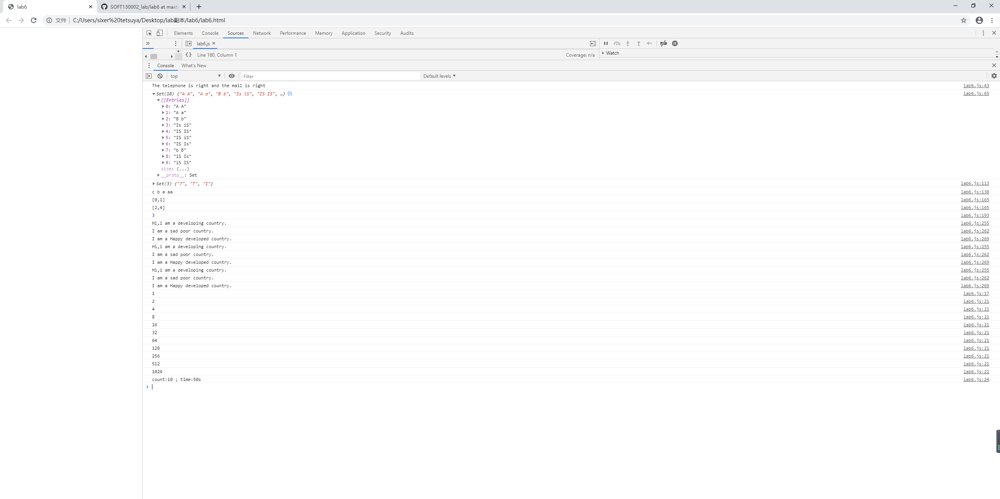

第2题：value1匹配1开头的11位数字；value2匹配一位及以上数字/字母/划线，一个@符号，一位及以上数字/字母/划线/任意位\(.数字/字母/划线,如.163\)，一位\(.两位及以上小写字母,如.com、.cn\)
   
第3题：字符串数组的第i项成为第i+1项的正则匹配，忽视大小写

继承：借用构造函数模式，不能完成函数复用，且继承不到父类原型的共享方法；原型链模式可能在原型中存在从父类得到的引用类型实例属性，并共享给子类所有实例，导致不安全，同时一旦向父类构造函数传参，意味着子类原型变化，并反映在所有子类实例上；
Object.create方式，既不能完成函数复用，也会导致引用类型共享的问题。

Map的键是松散类型的，可以更接近自然语言地将键与值联系起来，如键"name"和值"Peter",Array的键则是数字字符串,适合直观的循环;Set是key的集合，不会重复

