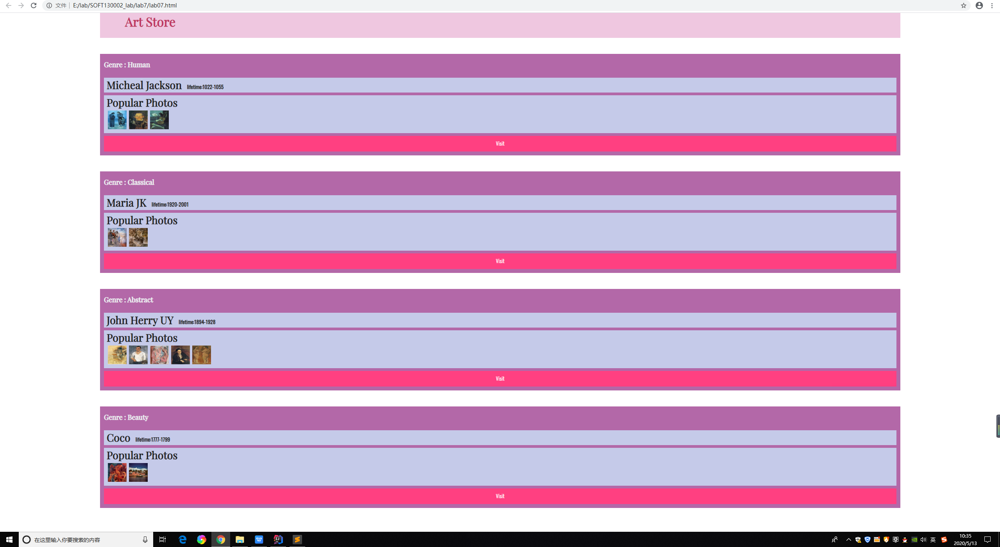
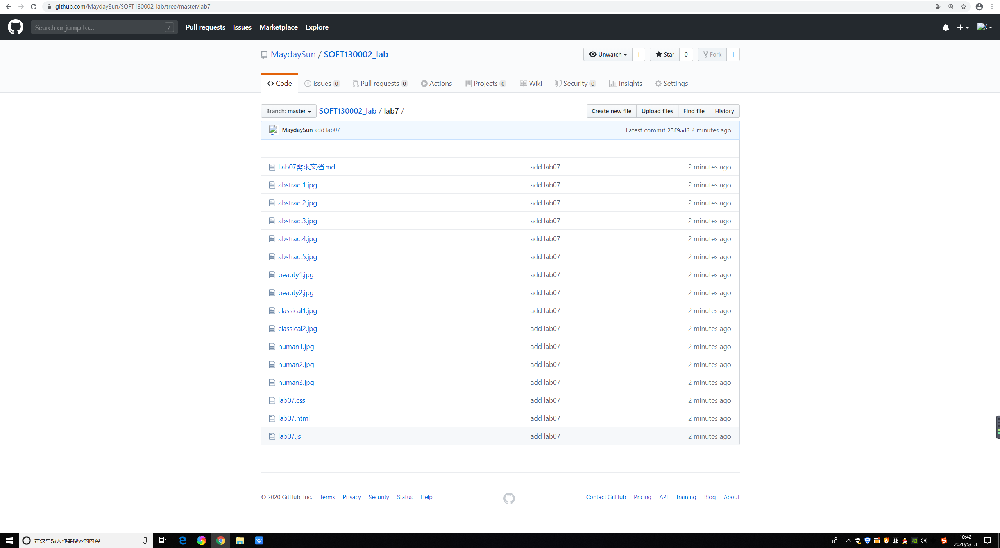

#lab7设计文档
主要困难及解决方案：

1.在用for in结构遍历works中的对象以及遍历photo数组时读出的属性都是undefined值，原因是for in只遍历数组的Key即数组下标，改用for i结构后正常显示

2.为使author与lifetime同行,需要设置CSS中的display属性,而author和"Popular Photos"在CSS中没有属性用以区分，故在js中为author设置class='.author',然后用querySelectorAll查询这个class下的节点

网页截图：

github截图：
